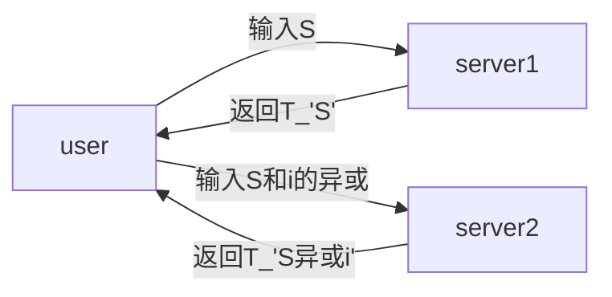

# PIR综述

## PIR是干什么的：

允许用户从存储在数据库系统中的一组消息中下载所需消息，而无需向数据库透露所需消息的索引（举个例子：在steam里下载游戏，我输入一个与游戏名无关的代号，数据库系统并不知道我要下载啥，但我能够下载我想要的游戏）

[PIR问世之作（Private Information Retrieval）](#jump1)

它的用途就是：在不泄露任何有关检索者需求、意图或兴趣的信息的情况下访问有用的数据。

对于$pir$，有用户隐私约束。（用上述的例子来讲，意思就是我输入了与游戏名无关的代号后，在单个数据库系统眼中，我输入的代号对于它里面所有的游戏是等价的，也就是说它完全不知道我要下载哪个游戏）也就是互信息量为0。

$pir$是有N个数据库，每个数据库中有k个独立分布的消息

## 对于PIR的性能考量：

$pir$问题的目标是设计满足隐私和正确性约束的方案，同时实现尽可能小的下载成本，即尽可能大的$pir$速率。

$pir$方案的下载成本定义为用户从所有数据库下载的比特总数，通过消息大小进行归一化。$pir$速率被定义为$pir$下载成本的倒数。

## 第一种方案：

假设用户想要下载第二消息$W_{2}$。作为查询，用户从$F_{q}$向数据库1发送K＝3个随机选择的符号，用[$h_{1}$，$h_{2}$，$h_{3}$]表示。同时，用户向数据库2发送[$h_{1}$，$h_{2}+1$，$h_{3}$]，其中“+”是有限域$F_{q}$内的加法；例如，在二进制字段中，它是XOR运算。收到查询后，每个数据库只需计算查询与三个消息符号的点积，并将结果作为单个符号发送回用户，如下图所示。然后，用户获得所需的消息，即$W_{2}$=$A_{2}$−$A_{1}$。用户隐私是有保证的，因为数据库是非串通的，并且每个数据库只是从$F_{q}$接收一组随机符号。该方案的速率为$R=\frac{1}{2}$，只需要两个库就可以实现$pir$方案。

### Private Information Retrieval

**初始想法**:fire:：在用户的意图被保密的情况下，用户通常对访问数据库持谨慎态度。可以看出，当访问单个数据库时，为了完全保证用户的隐私，整个数据库应该被下载；即应该传送n个比特（其中n是数据库中的比特数）

**实现方案**:bulb:：通过复制数据库，考虑是否可以获得更有效的私有检索问题的解决方案。使用户能够访问数据库的k个复制副本（$k\geq2$）并私下检索存储在数据库中的信息的方案。这意味着每个单独的服务器（拥有数据库的复制副本）都无法获得用户检索到的项目的标识信息。该方案使用复制来获得大量节省。特别地，该方案是一个通信复杂度为O（$n^{\frac{1}{3}}$）的双服务器方案。

**进一步的想法**:bulb:：之前想法不成熟的地方：让用户下载整个数据库的副本在通信成本上是不可接受的。因此我们将副本存放在其他服务器上。

**几个特性**:key:：

1. Perfect Privacy
2. Memoryless Protocol
3. Deterministic Server Strategies
4. Non-collusion
5. Coalitions

## 进入方案

**BASIC TWO-SERVER SCHEME**:fire:：假设每个客户端都有q个元素，为$x_{1},x_{2}...x_{q}$我们要检索的是$x_{i}$，定义[q]为从1到q的整数的集合。

其中S是一个随机的集合，元素$\in [q]$

定义T \_'S'为一个集合，其中的元素定义如下，if $k\in S$, then $x_{k}\in T(S)$

集合异或的定义如下所示：

将两个返回的值相异或即得到$x_{i}$

**MULTI-SERVER SCHEME**:fire:：此时有k($k\ge 2$)个服务器，向$k=2^{d}$个服务器询问可以得到所需的bit，此时通信量为$2^{d}*d*(n^{\frac{1}{d}}+1)$

有一个d维的空间，$n=l^{d}$，选择d个随机子集$S_{1}^{0},S_{2}^{0}...,S_{d}^{0}$，元素$\in [l]$，基于这些子集，再定义d个子集$S_{1}^{1}=S_{1}^{0}\oplus i_{1},S_{2}^{1} = S_{2}^{0}\oplus i_{2}...,S_{d}^{1}= S_{d}^{0}\oplus i_{d}$

对于每个服务端，发送d个子集，选取方式如下：

对k个服务器排序，每个的序号都可以映射成唯一的一个d位二进制串$\alpha = a_{1}a_{2}...a_{d}$，发送的子集为$S_{1}^{a_{1}},S_{2}^{a_{2}}...,S_{d}^{a_{d}}$

然后服务器的返回值如下所示：

该服务器序号是$\alpha = a_{1}a_{2}...a_{d}$，返回值为$\oplus_{j_{1}\in S_{1}^{\alpha_{1}}...j_{d}\in S_{d}^{\alpha_{d}}} x_{j_{1}}...x_{j_{d}}$ 

对于所有返回值，用户进行异或操作

### 2. 目录2